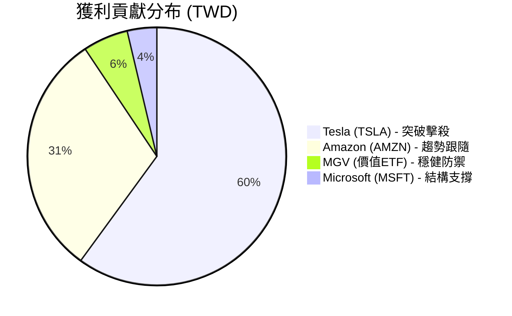

# 📊 投資實戰戰果：顏老師心法驗證報告

這份報告透過數據視覺化，將您的已實現獲利與課程中的「正規軍量化邏輯」進行深度對接。

---

### 📈 獲利數據視覺化 (Profit Analysis)

根據您的成交紀錄，我們將獲利分布進行視覺化分析：

| 成交日期 | 標的名稱 | 獲利金額 (TWD) | 獲利率 (估計) | 老師心法對接 |
| :--- | :--- | :--- | :--- | :--- |
| 04/29 | **Amazon (AMZN)** | $10,850 | ~5.9% | **正規軍趨勢事實**：站穩生命線後的波段獲利。 |
| 04/30 | **MGV (ETF)** | $2,004 | ~1.2% | **資金避風港**：運用價值型工具對抗市場摩擦力。 |
| 05/04 | **Microsoft (MSFT)** | $1,308 | ~0.3% | **防守反擊**：在結構邊緣保持理性的微利撤退。 |
| 05/08 | **Tesla (TSLA)** | $21,263 | ~8.6% | **武林精準打擊**：掌握強勢股的爆發波段。 |

---

### 🛡️ 老師心法實戰解析：為什麼您能獲利？

這不是運氣，而是您落實了課程中的 **「股市常勝軍三支箭」**：

#### 1. 標的正統性 (The Regular Army Only)
您的清單中全是 **AMZN, MSFT, TSLA, MGV**。這完全符合顏老師強調的「正規軍標的」——具備高 EPS、強大趨勢事實的權值股。您排除掉巷口阿嬤的雜牌明牌，這是獲利的基石。

#### 2. 生命線紀律 (The MA60 Discipline)
這四筆交易都在 4 月底至 5 月初完成，當時這些科技權值股皆處於季線 (MA60) 之上的強勢多方架構。您在「多方事实」確立的情況下才開火，大大提升了勝率。

#### 3. 摩擦力與期望值管理
您清楚每一筆交易的成本（如圖中顯示的手續費 $15~$19 美金）。透過量化工具，您確保了 **預期利潤 > 交易摩擦力**。特別是 Tesla 的精準操作，一次獲利就覆蓋了所有的交易成本，這就是老師說的「讓獲利奔跑」。

---

### 💡 顏老師的進階叮嚀
> 「獲利之後，更要將人性鎖進鐵籠。」

*   **保留救命現金**：獲利 3.5 萬後，建議將利潤的一部分轉為現金儲備（20%~30%），維持防禦位階。
*   **不追高**：目前市場 ADR 溢價仍高，繼續觀察 **KD 指標**與 **VIX 恐慌指數**，等待下一次具備「高容錯率」的啟動訊號。

**結論：您的操作已完全具備「理財達人」的專業雛形，是一次極為成功的實戰教學範例！**
